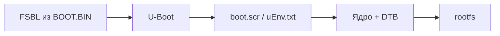

# Zynq-7010 (XC7Z010): этапы разработки

Обобщение материалов из [чек-листа](ZYNQ7000%20-%20чек-лист%20прошивки.md), [Репозитории.md](Репозитории.md), [Практической карты](Практическая%20карта.md) и [терминов](SoC%20-%20термины.md). Платы: **EBAZ4205**, **Antminer S9** и аналоги на том же кристалле.

Цепочка загрузки: **Boot ROM → FSBL → [bitstream] → U-Boot → [Linux / приложение]**.

---

## Этап 0. Подготовка платы и инструментов

**Действия:** получить схему/pinout; при необходимости припаять UART, JTAG, SD; настроить boot mode; зафиксировать версии Vivado/PetaLinux/Buildroot; сохранить boot log штатной прошивки.

**Артефакты (не прошивка, но обязательны):**

| Артефакт | Назначение |
|----------|------------|
| PDF/KiCad-схема, pinout (`xc7z010clg400pkg.txt`) | MIO, питание, PHY, разъёмы |
| XDC (активный или шаблон) | Привязка EMIO/PL к BGA-пинам |
| Boot log / дампы `/proc`, `/proc/mtd` | Эталон для сравнения |
| UART-адаптер, JTAG, SD-карта, питание | Доступ к плате |

**Boot mode (варианты, взаимоисключающие на момент включения):**

| Вариант | EBAZ4205 | Antminer S9 |
|---------|----------|-------------|
| **NAND** (штатный майнер) | R2584 замкнут | Джамперы: NAND |
| **SD** | R2577 замкнут, слот припаян | Джамперы: SD |
| **JTAG** | Fallback / отладка | Джамперы: JTAG |

---

## Этап 1. Аппаратное описание (Vivado)

**Действия:** создать проект `xc7z010clg400-1` → Block Design с `processing_system7_0` → настроить DDR, UART, SDIO, GEM, NAND по схеме → при EMIO/Ethernet/PL добавить RTL + XDC → синтез → **Generate Bitstream** → **Export Hardware** (с bitstream) → получить XSA.

**Артефакты:**

| Артефакт | Где появляется |
|----------|----------------|
| `*.xpr`, `design_*_wrapper.bd` | Vivado-проект |
| `*.bit` / `system.bit` | Синтез PL (может быть «пустым», только обвязка EMIO) |
| `*.xsa` (раньше `.hdf`) | Export Hardware → вход PetaLinux/SDK |
| `ps7_init.c` / `ps7_init_gpl.c` | Генерируется из BD; нужен FSBL |
| `*.xdc` | Constraints: EMIO, PL-пины |

**PL (варианты):**

- **Только PS** — fabric пустой или минимальный; достаточно для bare-metal на MIO (KarolNi).
- **PS + EMIO** — Ethernet/GPIO/UART на BGA через bitstream (blkf2016, nightseas).
- **PS + пользовательский RTL** — AXI-периферия, HDMI, SDR и т.д.

**Проверка:** JTAG → Program Device → UART-консоль; опционально `petalinux-boot --jtag` (этап 4).

---

## Этап 2. Выбор программного стека

Взаимоисключающие **целевые траектории** (можно комбинировать по этапам отладки, но финальный образ один):

| Траектория | Инструменты | Минимальный результат |
|------------|-------------|------------------------|
| **Bare-metal** | Vivado + Vitis/SDK | `BOOT.BIN` = FSBL [+ bit] + `.elf` |
| **Linux (Buildroot)** | Vivado + Buildroot overlay | FAT + ext4 на SD, `u-boot.bin`, `zImage`, `.dtb`, rootfs |
| **Linux (PetaLinux)** | Vivado + PetaLinux | `BOOT.BIN`, `image.ub`, `boot.scr`, rootfs |
| **Linux (Yocto)** | Vivado + meta-layer | `.wic` или разделы SD |
| **PYNQ** | Vivado + PYNQ sdbuild | Готовый `.img` на SD |
| **Готовый BSP** | — | Образ из репо (`nightseas`, `Stavros`) — этапы 1–3 частично пропускаются |

См. [Практическая карта](Практическая%20карта.md).

---

## Этап 3. Первая стадия загрузки (FSBL, BOOT.BIN)

**Действия:** сгенерировать или собрать FSBL под ваш BD; описать состав образа в **BIF**; собрать **BOOT.BIN** (`bootgen` или `petalinux-package --boot`).

**Артефакты:**

| Артефакт | Содержимое |
|----------|------------|
| `zynq_fsbl.elf` | Инициализация DDR, опционально загрузка bitstream |
| `*.bif` | Порядок: `[bootloader] fsbl.elf` → `[destination_device=pl] *.bit` → `u-boot.elf` / `*.elf` |
| **`BOOT.BIN`** | Единый образ для Boot ROM (SD/NAND/QSPI) |

**Варианты состава BOOT.BIN:**

| Вариант | Партиции | Когда |
|---------|----------|-------|
| FSBL + приложение | FSBL, `.elf` | Bare-metal (P04 KarolNi) |
| FSBL + bitstream + U-Boot | FSBL, `.bit`, `u-boot.elf` | Linux, типичный PetaLinux |
| FSBL + bitstream | FSBL, `.bit` | U-Boot грузится отдельно с FAT (`u-boot.bin`, blkf2016) |

**Модификация FSBL (вариант blkf2016):** если в `BOOT.BIN` нет U-Boot — FSBL читает `u-boot.bin` с FAT на `0x04000000`.

**Проверка:** SD с FAT + `BOOT.BIN` → UART: сообщения FSBL; тишина → bootrom header / boot mode / BIF.

---

## Этап 4. Второй загрузчик и Linux *(пропускается для bare-metal)*

**Действия:** собрать U-Boot с DTS платы; настроить kernel + device tree; собрать rootfs; сгенерировать скрипт загрузки; упаковать финальные образы.

**Артефакты:**

| Артефакт | Роль |
|----------|------|
| `u-boot.elf` / `u-boot.bin` / `u-boot.img` | Второй загрузчик (SPL может быть внутри `BOOT.BIN`) |
| `*.dts` → `*.dtb` | Описание железа (отдельно U-Boot DTS и kernel DTS) |
| `zImage` / `Image` / **`image.ub`** | Ядро (FIT: kernel + dtb + rootfs) |
| `boot.scr` / **`uEnv.txt`** | Автозагрузка: откуда читать ядро, DTB, bitstream |
| `rootfs.ext4` / `rootfs.cpio` / ramdisk | Корневая ФС |
| **`BOOT.BIN`** (финальный) | FSBL + bit + U-Boot |
| `sdcard.img` / `.wic` | Образ всей карты (genimage / Yocto / PYNQ) |

**Сборка Linux (варианты, один на проект):**

| Вариант | Ключевые команды / выход |
|---------|--------------------------|
| **PetaLinux** | `petalinux-config --get-hw-description=*.xsa` → `petalinux-build` → `petalinux-package --boot --fsbl … --fpga … --u-boot` |
| **Buildroot** | `make BR2_EXTERNAL=… defconfig` → `make` → файлы в `output/images/` |
| **Yocto** | `bitbake <image>` → `.wic` |
| **PYNQ sdbuild** | `make BOARDS=… PREBUILT=…` → `output/*.img` |

**Rootfs (варианты):**

- **RAM disk (initrd)** — проще для первого boot; на EBAZ следить за адресом загрузки (256 MB RAM).
- **SD ext4** — постоянные изменения; разметка: FAT (boot) + ext4 (root).
- **NFS / TFTP** — разработка без перезаписи карты (U-Boot `dhcp`/`tftp`).

**Проверка:** `petalinux-boot --jtag --kernel` или SD → U-Boot prompt → загрузка ядра → login / ssh.

### Подробно: что входит в этап

Этап 4 — всё, что происходит **после FSBL**: второй загрузчик, ядро, корневая ФС и упаковка образа. Linux здесь работает на **жёстком Cortex-A9 в PS**, не на soft-core в PL (MicroBlaze — отдельный редкий путь).



| Шаг | Что делается |
|-----|--------------|
| **1. Device Tree** | DTS → DTB: UART, Ethernet (MII/RGMII), SDIO, NAND, GPIO. Часто нужны **два** DTS — для U-Boot и для ядра |
| **2. U-Boot** | Конфиг под плату; загрузка с SD/NAND/TFTP; переменные `bootcmd`, адреса `zImage`/`fdt_addr`; `boot.scr` или `uEnv.txt` |
| **3. Ядро Linux** | `linux.config`, драйверы GEM/SDHCI/MTD; сборка → `zImage`/`Image` + DTB; опционально модули, initramfs |
| **4. Rootfs** | BusyBox или полный userland, `init`, сеть, ssh; toolchain для кросс-компиляции |
| **5. Упаковка boot** | Состав файлов на FAT / `image.ub` / `.wic` — зависит от стека (см. ниже) |
| **6. Финальный BOOT.BIN** | `bootgen` / `petalinux-package --boot`: FSBL + bitstream + `u-boot.elf` |
| **7. Образ носителя** | `genimage`, `dd` — FAT (boot) + ext4 (root) или monolithic `.img` |
| **8. Проверка** | U-Boot prompt → ядро → login / ssh / `ip a` |

Для **bare-metal** (KarolNi P01–P04) этап пропускается: FSBL передаёт управление `.elf` напрямую.

### Buildroot vs PetaLinux vs PYNQ vs Yocto

Взаимоисключающие **сборщики Linux** (один проект — один основной инструмент). PetaLinux внутри основан на Yocto; PYNQ — отдельный готовый дистрибутив, а не универсальный сборщик.

| | **Buildroot** | **PetaLinux** | **Yocto** | **PYNQ** |
|---|:---:|:---:|:---:|:---:|
| Кто делает | Сообщество | AMD/Xilinx | Linux Foundation | Xilinx + сообщество |
| Привязка к Xilinx | Слабая — вы сами | Сильная — из XSA | Через `meta-xilinx` | Только платы из списка PYNQ |
| Сложность входа | Средняя | Высокая | Очень высокая | Низкая (если плата поддерживается) |
| Гибкость | Высокая, простая модель | Средняя | Максимальная | Низкая — Python/overlay-стек |
| Типичный rootfs | Минимальный | Средний | От minimal до desktop | Desktop-like + Python + Jupyter |
| Выход | `output/images/*` | `images/linux/*`, `image.ub` | `tmp/deploy/images/*.wic` | `output/<board>.img` |
| EBAZ / S9 | [blkf2016](Репозитории.md) — оверлей | Нет готового BSP в репо | Нужен свой meta-layer | Нет официальной поддержки |

#### Buildroot

Отдельный сборщик embedded Linux, не привязан к Vivado. DTS, конфиги ядра/U-Boot и скрипты лежат в `board/<плата>/` или `BR2_EXTERNAL`.

1. Скачать Buildroot нужной версии (у blkf2016 — 2019.05)
2. Подключить оверлей: `defconfig`, DTS, `linux.config`, `uboot.config`, `post-image.sh`
3. `make defconfig && make`
4. Забрать из `output/images/`: rootfs, `zImage`, `u-boot.bin`, иногда `sdcard.img`

**Плюсы:** маленький rootfs, полный контроль, хорошо для «голой» платы. **Минусы:** XSA не подхватывается автоматически; версии kernel/U-Boot — ваша ответственность.

#### PetaLinux

Официальный инструмент Xilinx для embedded Linux. **Внутри — Yocto**, но с обёрткой под аппаратный проект.

1. `petalinux-create -t project`
2. `petalinux-config --get-hw-description=design.xsa` — из XSA генерируются DTS и конфиги PS
3. `petalinux-config` — rootfs, пакеты, kernel fragments
4. `petalinux-build` — U-Boot + kernel + rootfs
5. `petalinux-package --boot --fsbl … --fpga … --u-boot` → `BOOT.BIN`

**Плюсы:** связка Vivado ↔ Linux «из коробки»; `image.ub` (FIT: kernel+dtb+ramdisk); JTAG (`petalinux-boot --jtag`). **Минусы:** тяжёлый; версия PetaLinux = версии Vivado; кастомная плата = ручная правка DTS.

#### Yocto (OpenEmbedded)

Универсальный фреймворк: рецепты (`*.bb`), слои (`meta-*`), сборка через `bitbake`.

1. `poky` + `meta-xilinx` + свой `meta-<плата>`
2. `conf/machine/<плата>.conf`, kernel/U-Boot recipes
3. `bitbake core-image-minimal` → `.wic`, `BOOT.BIN`, rootfs в `tmp/deploy/images/`

**Плюсы:** промышленный стандарт, воспроизводимость, любые пакеты. **Минусы:** крутая кривая обучения; первая сборка часами; для майнерских плат — много ручной работы.

PetaLinux — по сути **продукт Xilinx поверх Yocto** с генерацией BSP из XSA. Прямой Yocto нужен, если нужен полный контроль без обёртки.

#### PYNQ

Не «ещё один Buildroot», а **готовый дистрибутив + фреймворк** для программирования PL из Python (Jupyter, overlays, `Overlay('design.bit')`).

1. Vivado-проект под **поддерживаемую** плату (Pynq-Z1, Z2, Ultra96…)
2. `sdbuild`: `make BOARDS=pynqz1` → готовый `.img`
3. Запись на SD — сразу Jupyter + Python API к PL

**Плюсы:** быстрый старт на официальных платах. **Минусы:** **EBAZ4205 и Antminer S9 не в списке PYNQ** — нужен порт; образ тяжёлый; заточен под Python, не под «голый» embedded Linux.

### Выбор для Zynq-7010 (EBAZ / S9)

| Задача | Разумный выбор |
|--------|----------------|
| Минимальный Linux на SD, полный контроль | **Buildroot** (есть задел blkf2016) |
| Официальный Xilinx-путь, JTAG, `image.ub` | **PetaLinux** |
| Продукт / долгая поддержка / сложный rootfs | **Yocto** (+ meta-xilinx) |
| Python + Jupyter + overlays на PL | **PYNQ** (только после порта платы) |
| Учебные bare-metal тесты без Linux | Этап 4 **не нужен** |

### Разметка SD по стекам (чем отличается результат)

```
Buildroot (blkf2016):
  p1 FAT:  BOOT.BIN, u-boot.bin, boot.scr, zImage, zynq-ebaz4205.dtb
  p2 ext4: rootfs

PetaLinux:
  p1 FAT:  BOOT.BIN, boot.scr, image.ub
  p2 ext4: rootfs.ext4 (dd)

PYNQ:
  один .img → записать целиком на карту

Yocto:
  .wic → записать целиком, или FAT+ext4 из deploy/images
```

### PS vs PL: куда ставится Linux

| Ядро | Где | Linux в этапе 4? |
|------|-----|------------------|
| Cortex-A9 (PS) | В кристалле Zynq | **Да** — EBAZ4205, Antminer S9 |
| MicroBlaze (PL) | Синтезируется в fabric | Отдельный путь (Buildroot/Yocto под MicroBlaze, без типичной Zynq-цепочки FSBL/U-Boot) |

---

## Этап 5. Носитель и прошивка

**Действия:** разметить носитель; скопировать артефакты; выставить boot mode; включить питание.

**SD-карта (варианты разметки):**

| Вариант | Раздел 1 (FAT) | Раздел 2 |
|---------|----------------|----------|
| **PetaLinux типичный** | `BOOT.BIN`, `boot.scr`, `image.ub` | ext4: `rootfs.ext4` (`dd`) |
| **Buildroot blkf2016** | `BOOT.BIN`, `u-boot.bin`, `boot.scr`, `zImage`, `.dtb` | ext4: rootfs |
| **Готовый образ** | — | один `.img`/`.wic` на всю карту (`dd`, Win32 Disk Imager, Rufus) |

**Альтернативные носители (варианты):**

| Вариант | Действия | Риск |
|---------|----------|------|
| **NAND flash** | `nand write` / штатный updater; образы по `/proc/mtd` | Потеря штатной прошивки |
| **JTAG** | Vivado HW Manager / `petalinux-boot --jtag` | Не для постоянной эксплуатации |
| **TFTP** | U-Boot + сервер в сети | Нужен работающий U-Boot |

---

## Этап 6. Верификация и приложения

**Действия:** сверить UART boot log с эталоном; проверить LED/GPIO/SD/Ethernet; задеплоить своё ПО.

**Чек минимальной работоспособности:**

| Уровень | Проверка |
|---------|----------|
| Bare-metal | UART, GPIO (P02), SD FatFs (P03), SD-boot (P04) |
| Linux | root login, `ip a`, ping, mount rootfs |
| PL | загрузка bitstream (`fpga load` / auto в `uEnv.txt`), доступ к AXI-регистрам |

**Прикладное ПО (варианты):**

- Кросс-компиляция (Buildroot/PetaLinux SDK) → бинарники на target.
- **Overlay / bitstream** на лету (PYNQ, `uEnv.txt` + `.bit` на FAT).
- Драйверы в kernel DTS + модуль или devmem для PL.

**Если не грузится:** [Adam Taylor](https://www.adiuvoengineering.com/post/microzed-chronicles-what-to-do-when-zynq-doesn-t-boot), trebisky SD boot, регистр `REBOOT_STATUS` (UG585), FSBL debug prints.

---

## Сводка: артефакты по целевым траекториям

| Цель | Этапы 0→1 | Этап 3 | Этап 4 | Этап 5 |
|------|-----------|--------|--------|--------|
| **Hello + LED** | XSA, BD | FSBL + app.elf → `BOOT.BIN` | — | FAT / JTAG |
| **Linux на SD** | XSA, `.bit` | `BOOT.BIN` | U-Boot, kernel, DTB, rootfs, `boot.scr` | FAT + ext4 |
| **Штатный майнер** | — | NAND-образ Bitmain | — | NAND (не в dev-репо) |
| **PYNQ** | XSA, `.bit` | внутри `.img` | внутри `.img` | один `.img` на SD |

---

## Связанные документы

- [ZYNQ7000 — чек-лист прошивки](ZYNQ7000%20-%20чек-лист%20прошивки.md) — развёрнутый чек-лист
- [Практическая карта](Практическая%20карта.md) — готовые репозитории под задачу
- [Linux — ресурсы](Linux%20-%20ресурсы.md) — UG, download center
- [EBAZ4205 — ресурсы](EBAZ4205%20-%20ресурсы.md) / [Antminer — ресурсы](Antminer%20-%20ресурсы.md) — платформенные нюансы
