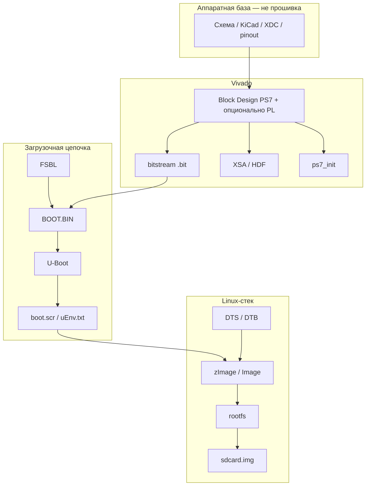

# Чек-лист прошивки для плат Zynq-7010

Максимальный чек-лист для вывода в работу платы Zynq-7010 (EBAZ4205 или S9) на основе примеров из [Репозитории.md](Репозитории.md). Для минимального старта достаточно подмножества; пункты помечены по уровню.

---

## Как устроен Zynq (контекст)

Zynq-7000 — это **два мира в одном чипе**:

| Часть | Название | Что делает |
|-------|----------|------------|
| **PS** (Processing System) | ARM Cortex-A9 + периферия | Загрузчик, Linux/bare-metal, Ethernet, SD, UART |
| **PL** (Programmable Logic) | FPGA (Artix-7) | Ваша логика: HDMI, GPIO, ускорители, интерфейсы |

Прошивка для отладочной платы — это цепочка артефактов, которые PS (и при необходимости PL) загружает при включении. Документация, схемы и KiCad — **не прошивка**, но без них прошивку собрать нельзя.

---

## Максимальный чек-лист: что подготовить для платы

### A. Аппаратура и доступ к плате

- [ ] **A1.** Питание 5–12 V (EBAZ4205 — разъём PHD; S9 — штатный разъём)
- [ ] **A2.** UART-адаптер (USB–TTL 3.3 V) на консоль
- [ ] **A3.** JTAG (Platform Cable / DLC9G / FT2232) — для прошивки и отладки
- [ ] **A4.** SD-карта + разъём (на EBAZ4205 часто нужна пайка + **boot select** на SD)
- [ ] **A5.** Ethernet-кабель (MII/RGMII в зависимости от платы)
- [ ] **A6.** Схема + **XDC** с реальными пинами (не закомментированный шаблон)
- [ ] **A7.** Понимание boot mode: NAND (штатный майнер) / SD / JTAG

### B. Аппаратный проект Vivado (обязателен для любого серьёзного стека)

- [ ] **B1.** Vivado-проект под **xc7z010clg400-1**
- [ ] **B2.** Block Design PS7: DDR, UART, SDIO, GEM (Ethernet), NAND/QSPI при необходимости
- [ ] **B3.** MIO/EMIO согласованы со схемой платы (у S9 — кнопки S1/S2, LED_R/G в MIO)
- [ ] **B4.** XDC: привязка пинов PL и (если есть) EMIO
- [ ] **B5.** Опционально: RTL в PL (HDMI, шины…) + синтез → **bitstream**
- [ ] **B6.** Экспорт **XSA** (для PetaLinux / повторного использования)
- [ ] **B7.** `ps7_init` / `ps7_init_gpl.c` согласован с вашим BD

### C. Минимальный boot (bare-metal, без Linux)

- [ ] **C1.** FSBL (из SDK или кастом, как у blkf2016)
- [ ] **C2.** Опционально: bitstream в `BOOT.BIN`
- [ ] **C3.** Приложение `.elf` (Hello World, GPIO, SD test)
- [ ] **C4.** **BIF** + сборка **BOOT.BIN**
- [ ] **C5.** Запись на SD (раздел FAT) или прошивка в flash
- [ ] **C6.** Проверка: UART, LED, SD (как P01–P04 у KarolNi)

### D. Полный Linux на SD (целевой стек, близок к blkf2016)

- [ ] **D1.** Всё из блока **B** (хотя бы PS без PL или с пустым bitstream)
- [ ] **D2.** **FSBL**, при необходимости с логикой «грузить U-Boot с SD»
- [ ] **D3.** **U-Boot** с конфигом и **патчем/DTS** под плату
- [ ] **D4.** **boot.scr** или **uEnv.txt** (откуда грузить ядро и DTB)
- [ ] **D5.** **Ядро Linux** (`zImage`/`Image`) + **kernel DTS** → **DTB**
- [ ] **D6.** **rootfs** (Buildroot / PetaLinux / Buildroot overlay)
- [ ] **D7.** Разметка SD: boot (FAT: `BOOT.BIN`, `u-boot.bin`, `boot.scr`, `zImage`, `.dtb`) + root (ext4)
- [ ] **D8.** **genimage** → **sdcard.img** или ручная запись разделов
- [ ] **D9.** Сеть: статический IP / DHCP, ssh (как в overlay blkf2016)
- [ ] **D10.** Проверка: загрузка, `ifconfig`, ping, mount rootfs

### E. Linux с сетевой загрузкой (опционально, уровень S9/polprog «в плане»)

- [ ] **E1.** U-Boot: `dhcp`, `tftp`
- [ ] **E2.** TFTP-сервер: ядро, DTB, иногда initramfs
- [ ] **E3.** NFS или initramfs для root

### F. Прошивка во внутреннюю память (NAND / QSPI на майнерах)

- [ ] **F1.** Разметка flash (из boot log / `/proc/mtd`)
- [ ] **F2.** U-Boot: команды `nand write` / `sf write` или штатный updater
- [ ] **F3.** Образы под размер разделов (bitstream, kernel, rootfs)
- [ ] **F4.** **Не уничтожить** boot partition и возможность восстановления (JTAG/SD)

### G. Прикладное ПО и окружение разработки

- [ ] **G1.** Кросс-компилятор (из Buildroot/PetaLinux/SDK)
- [ ] **G2.** OpenSSH / инструменты на целевой системе
- [ ] **G3.** Драйверы под периферию PL (если есть RTL)
- [ ] **G4.** OpenWrt / PetaLinux — отдельный трек, если нужен роутер или Xilinx-стек

### H. Документация и верификация (не прошивка, но в чек-листе)

- [ ] **H1.** Boot log эталонной платы для сравнения
- [ ] **H2.** Версии инструментов зафиксированы (Vivado 2019.1 vs 2017.4 — см. KarolNi vs blkf2016)
- [ ] **H3.** Резервная копия штатной NAND перед экспериментами

---

## Минимум vs максимум (кратко)

| Цель | Нужно собрать |
|------|----------------|
| **Мигание LED + UART** | Vivado PS7 + SDK app + FSBL + BOOT.BIN |
| **Linux на SD** | B + FSBL + U-Boot + kernel + DTB + rootfs + boot.scr + разметка SD |
| **Как заводской майнер** | Образы в NAND + bitstream + Angstrom + miner (не в ваших репо) |
| **С HDMI-расширением** | Всё выше + EBAZEXT PCB + PL RTL + bitstream + драйвер/приложение |
