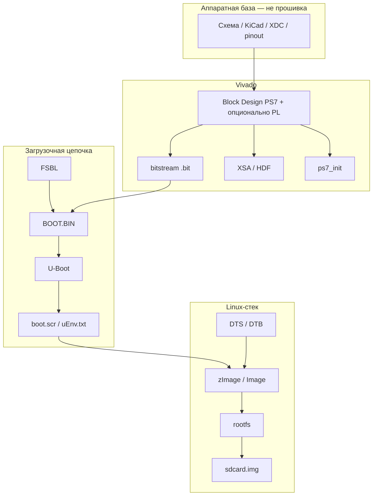

# Термины из «Что сделано» и чек-лист прошивки для Zynq-плат

Разбор терминов из колонки «Что сделано» в [Репозитории.md](Репозитории.md): что из них относится к прошивке/проекту, и максимальный чек-лист для вывода платы в работу.

---

## Как устроен Zynq (контекст)

Zynq-7000 — это **два мира в одном чипе**:

| Часть | Название | Что делает |
|-------|----------|------------|
| **PS** (Processing System) | ARM Cortex-A9 + периферия | Загрузчик, Linux/bare-metal, Ethernet, SD, UART |
| **PL** (Programmable Logic) | FPGA (Artix-7) | Ваша логика: HDMI, GPIO, ускорители, интерфейсы |

Прошивка для отладочной платы — это цепочка артефактов, которые PS (и при необходимости PL) загружает при включении. Документация, схемы и KiCad — **не прошивка**, но без них прошивку собрать нельзя.

---

## Словарь терминов (все из «Что сделано»)

### Аппаратная документация (не прошивка)

| Термин | Что это | Зачем |
|--------|---------|-------|
| **KiCad-проект** | Исходники схемы и печатной платы в KiCad | Понять разводку, пины, питание; заказать PCB |
| **PCB + иерархическая схема** | Разведённая плата и схема по листам (IO, питание, память…) | Карта железа; отличие от «голого» PDF |
| **PDF-схема** | Готовый чертёж для просмотра/печати | Быстрый референс без CAD |
| **Altium / Protel PCB** | Файлы в форматах производителя/импорта | Оригинальная разводка майнера |
| **STL-подставка** | 3D-модель крепления | Механика, не электроника |
| **Фото платы** | Снимки ревизий | Идентификация разъёмов, boot select, SD |
| **pinout Zynq-7010** | Таблица: какой BGA-пин = какая функция (MIO, PL) | Привязка периферии к SoC |
| **EBAZEXT-V2** (KiCad) | **Отдельная** плата расширения к EBAZ4205 | HDMI, UART, CMOS и т.д. — это **другой** HW-проект, не прошивка материнской платы |
| **gerber** (отсутствует) | Файлы для завода по изготовлению PCB | Нужны для заказа платы, не для загрузки |

### Ограничения и привязка пинов (часть FPGA-проекта)

| Термин | Что это | Часть прошивки? |
|--------|---------|-----------------|
| **XDC** | Файл constraints Vivado: какой логический сигнал на какой физический пин | **Да** — вход в сборку bitstream/BD |
| **Шаблон XDC (пины закомментированы)** | Справочник пинов без активных constraints | **Нет** — только документация |
| **Vivado TCL-скрипт** (`ebaz4205.tcl`) | Скрипт, создающий Block Design (PS7, EMIO Ethernet…) | **Да** — генерация аппаратного описания |
| **Vivado 2018.3 / 2019.1** | Версия Xilinx IDE | Инструмент; артефакты между версиями не всегда совместимы |

### FPGA / Vivado (ядро аппаратного проекта)

| Термин | Что это | Часть прошивки? |
|--------|---------|-----------------|
| **Vivado-проект** (`.xpr`) | Проект: BD, constraints, синтез | **Да** |
| **Block Design / PS7** | Графическая настройка ARM + MIO/EMIO/PL | **Да** |
| **Только PS7 без PL-логики** | В fabric нет своего RTL, только «оболочка» вокруг процессора | **Да**, но bitstream может быть пустым/минимальным |
| **PL-логика / FPGA-код / RTL** | Verilog/VHDL в программируемой части | **Да**, если нужны HDMI, кастомные шины и т.д. |
| **bitstream** (`.bit`) | Бинарник конфигурации PL | **Да** — часто входит в `BOOT.BIN` |
| **XSA** (раньше HDF) | Экспорт аппаратуры из Vivado для PetaLinux/SDK | **Да** — связующее звено HW ↔ софт |
| **ps7_init** | Код/таблицы инициализации DDR, тактов PS | **Да** — в FSBL и при старте |

### Загрузочная цепочка (boot)

| Термин | Что это | Часть прошивки? |
|--------|---------|-----------------|
| **FSBL** (First Stage Boot Loader) | Первый код после ROM: DDR, опционально bitstream, переход дальше | **Да** |
| **Модифицированный FSBL** (blkf2016) | FSBL, который с SD читает `u-boot.bin` вместо приложения | **Да** |
| **BOOT.BIN** | Образ Xilinx: FSBL [+ bitstream] [+ приложение] | **Да** — главный файл для SD/QSPI/NAND |
| **BIF** | Текстовый манифест: что положить в `BOOT.BIN` | **Да** — рецепт сборки |
| **SD-boot** | Загрузка с карты (вместо NAND/flash) | **Режим**, не файл |
| **U-Boot** | Второй загрузчик: сеть, FAT/ext4, меню, передача ядру | **Да** (для Linux) |
| **boot.scr** | Скомпилированный скрипт U-Boot (из `.txt`) | **Да** |
| **uEnv.txt** | Переменные окружения U-Boot (альтернатива/дополнение `boot.scr`) | **Да** |
| **boot log** | Захват UART при включении | **Нет** — диагностика, не прошивка |

### Linux / rootfs

| Термин | Что это | Часть прошивки? |
|--------|---------|-----------------|
| **BSP** (Board Support Package) | Набор под плату: HW-описание + ядро + U-Boot + rootfs | **Да** — «проект под железо» |
| **Buildroot** | Сборщик минимального Linux (rootfs + toolchain) | Инструмент → даёт **rootfs**, ядро, U-Boot |
| **Оверлей Buildroot** | Папка `board/<плата>/` поверх дистрибутива Buildroot | **Да** — конфиги, DTS, скрипты |
| **DTS / DTB** | Device Tree: описание железа для ядра/U-Boot | **Да** |
| **U-Boot DTS** vs **kernel DTS** | DTS для загрузчика и для ядра (могут отличаться) | **Да** — оба нужны для полного Linux |
| **linux.config / uboot.config** | Конфигурация ядра и U-Boot под плату | **Да** |
| **zImage** | Сжатое ядро Linux для ARM | **Да** |
| **rootfs** | Корневая ФС: `/bin`, `/etc`, библиотеки | **Да** |
| **rootfs overlay** | Доп. файлы поверх rootfs (`/etc/network`, dnsmasq…) | **Да** |
| **genimage** | Утилита: собрать `sdcard.img` (разделы boot + root) | Инструмент → **sdcard.img** |
| **sdcard.img** | Образ всей карты | **Да** — готовый артефакт для записи |
| **dnsmasq, статический IP** | Сеть в rootfs | **Да** — часть образа, не boot |

### Разработка приложений

| Термин | Что это | Часть прошивки? |
|--------|---------|-----------------|
| **bare-metal** | Программа без ОС, напрямую на ARM | **Да** — альтернатива Linux |
| **Vivado/SDK** | Старая схема: FSBL + приложение `.elf` | **Да** (учебные P01–P04) |
| **PetaLinux** | Xilinx-сборка Linux из XSA | **Да** — полный Linux-стек (в репо почти нет) |
| **Hello World / UART** | Тест консоли | Приложение в цепочке boot |
| **GPIO (кнопки/LED)** | Тест MIO/EMIO | Приложение |
| **FatFs / SD_TEST** | Файловая система на SD в bare-metal | Приложение |
| **FSBL + приложение (P04)** | Загрузка с SD без Linux | **Да** — минимальный boot-стек |

### Только справочные материалы (не прошивка)

| Термин | Что это |
|--------|---------|
| **Дампы `/proc`** | Снимки с работающей штатной ОС майнера |
| **Инструкции** (сброс пароля, cgminer, сеть) | Работа со **штатной** прошивкой на NAND |
| **README, wiki, фото** | Документация |
| **Angstrom / bmminer** в boot log | Компоненты **заводской** прошивки Bitmain, не вашего репо |
| **Внешние ссылки** (bare-metal статьи, OpenWrt, HDMI soft-decode) | Материалы вне репозитория |

---

## Что из репозиториев — части проекта/прошивки

### EBAZ4205

| Репозиторий | Прошивка / проект | Только документация / HW |
|-------------|-------------------|---------------------------|
| **Elrori** | XDC, DTS, uEnv, ps7_init (фрагменты SD-boot) | KiCad EBAZEXT-V2, pinout, ссылки |
| **xjtuecho** | Шаблон XDC (неактивный) | KiCad, PDF, логи, `/proc`, инструкции |
| **blkf2016** | **Почти полный BSP**: FSBL, Buildroot-оверлей, DTS, U-Boot/kernel configs, boot.scr, genimage, Vivado TCL/XDC | Нет готовых `.bin`/`.img` |

### Antminer S9

| Репозиторий | Прошивка / проект | Только документация |
|-------------|-------------------|---------------------|
| **KarolNi** | 4 Vivado/SDK проекта (BD PS7, bare-metal apps, FSBL+BIF в P02/P04) | PDF схемы |
| **polprog** | U-Boot DTS (один файл) | Фото, boot log, README |

---

## Максимальный чек-лист: что подготовить для платы

Ниже — **полный** список для Zynq-7010 (EBAZ4205 или S9). Для минимального старта достаточно подмножества; пункты помечены по уровню.

### A. Аппаратура и доступ к плате

- [ ] **A1.** Питание 5–12 V (EBAZ4205 — разъём PHD; S9 — штатный разъём)
- [ ] **A2.** UART-адаптер (USB–TTL 3.3 V) на консоль
- [ ] **A3.** JTAG (Platform Cable / DLC9G / FT2232) — для прошивки и отладки
- [ ] **A4.** SD-карта + разъём (на EBAZ4205 часто нужна пайка + **boot select** на SD)
- [ ] **A5.** Ethernet-кабель (MII/RGMII в зависимости от платы)
- [ ] **A6.** Схема + **XDC** с реальными пинами (не закомментированный шаблон)
- [ ] **A7.** Понимание boot mode: NAND (штатный майнер) / SD / JTAG

### B. Аппаратный проект Vivado (обязателен для любого серьёзного стека)

- [ ] **B1.** Vivado-проект под **xc7z010clg400-1**
- [ ] **B2.** Block Design PS7: DDR, UART, SDIO, GEM (Ethernet), NAND/QSPI при необходимости
- [ ] **B3.** MIO/EMIO согласованы со схемой платы (у S9 — кнопки S1/S2, LED_R/G в MIO)
- [ ] **B4.** XDC: привязка пинов PL и (если есть) EMIO
- [ ] **B5.** Опционально: RTL в PL (HDMI, шины…) + синтез → **bitstream**
- [ ] **B6.** Экспорт **XSA** (для PetaLinux / повторного использования)
- [ ] **B7.** `ps7_init` / `ps7_init_gpl.c` согласован с вашим BD

### C. Минимальный boot (bare-metal, без Linux)

- [ ] **C1.** FSBL (из SDK или кастом, как у blkf2016)
- [ ] **C2.** Опционально: bitstream в `BOOT.BIN`
- [ ] **C3.** Приложение `.elf` (Hello World, GPIO, SD test)
- [ ] **C4.** **BIF** + сборка **BOOT.BIN**
- [ ] **C5.** Запись на SD (раздел FAT) или прошивка в flash
- [ ] **C6.** Проверка: UART, LED, SD (как P01–P04 у KarolNi)

### D. Полный Linux на SD (целевой стек, близок к blkf2016)

- [ ] **D1.** Всё из блока **B** (хотя бы PS без PL или с пустым bitstream)
- [ ] **D2.** **FSBL**, при необходимости с логикой «грузить U-Boot с SD»
- [ ] **D3.** **U-Boot** с конфигом и **патчем/DTS** под плату
- [ ] **D4.** **boot.scr** или **uEnv.txt** (откуда грузить ядро и DTB)
- [ ] **D5.** **Ядро Linux** (`zImage`/`Image`) + **kernel DTS** → **DTB**
- [ ] **D6.** **rootfs** (Buildroot / PetaLinux / Buildroot overlay)
- [ ] **D7.** Разметка SD: boot (FAT: `BOOT.BIN`, `u-boot.bin`, `boot.scr`, `zImage`, `.dtb`) + root (ext4)
- [ ] **D8.** **genimage** → **sdcard.img** или ручная запись разделов
- [ ] **D9.** Сеть: статический IP / DHCP, ssh (как в overlay blkf2016)
- [ ] **D10.** Проверка: загрузка, `ifconfig`, ping, mount rootfs

### E. Linux с сетевой загрузкой (опционально, уровень S9/polprog «в плане»)

- [ ] **E1.** U-Boot: `dhcp`, `tftp`
- [ ] **E2.** TFTP-сервер: ядро, DTB, иногда initramfs
- [ ] **E3.** NFS или initramfs для root

### F. Прошивка во внутреннюю память (NAND / QSPI на майнерах)

- [ ] **F1.** Разметка flash (из boot log / `/proc/mtd`)
- [ ] **F2.** U-Boot: команды `nand write` / `sf write` или штатный updater
- [ ] **F3.** Образы под размер разделов (bitstream, kernel, rootfs)
- [ ] **F4.** **Не уничтожить** boot partition и возможность восстановления (JTAG/SD)

### G. Прикладное ПО и окружение разработки

- [ ] **G1.** Кросс-компилятор (из Buildroot/PetaLinux/SDK)
- [ ] **G2.** OpenSSH / инструменты на целевой системе
- [ ] **G3.** Драйверы под периферию PL (если есть RTL)
- [ ] **G4.** OpenWrt / PetaLinux — отдельный трек, если нужен роутер или Xilinx-стек

### H. Документация и верификация (не прошивка, но в чек-листе)

- [ ] **H1.** Boot log эталонной платы для сравнения
- [ ] **H2.** Версии инструментов зафиксированы (Vivado 2019.1 vs 2017.4 — см. KarolNi vs blkf2016)
- [ ] **H3.** Резервная копия штатной NAND перед экспериментами

---

## Практическая карта: «что взять из какого репо»

**EBAZ4205, Linux на SD (максимально полный путь из имеющегося):**

1. Схема и пины — **xjtuecho** (KiCad, XDC-шаблон) + **Elrori** (рабочий DTS/uEnv)
2. Сборка — **blkf2016** (FSBL, Buildroot, Vivado TCL)
3. Плата расширения HDMI — отдельно **Elrori EBAZEXT-V2** + свой PL + драйверы

**Antminer S9, bare-metal:**

1. Примеры — **KarolNi** P01→P04
2. DTS для ориентира — **polprog**
3. Полный Linux — **собирать самому** по аналогии с blkf2016 + DTS из polprog/Xilinx

---

## Минимум vs максимум (кратко)

| Цель | Нужно собрать |
|------|----------------|
| **Мигание LED + UART** | Vivado PS7 + SDK app + FSBL + BOOT.BIN |
| **Linux на SD** | B + FSBL + U-Boot + kernel + DTB + rootfs + boot.scr + разметка SD |
| **Как заводской майнер** | Образы в NAND + bitstream + Angstrom + miner (не в ваших репо) |
| **С HDMI-расширением** | Всё выше + EBAZEXT PCB + PL RTL + bitstream + драйвер/приложение |
