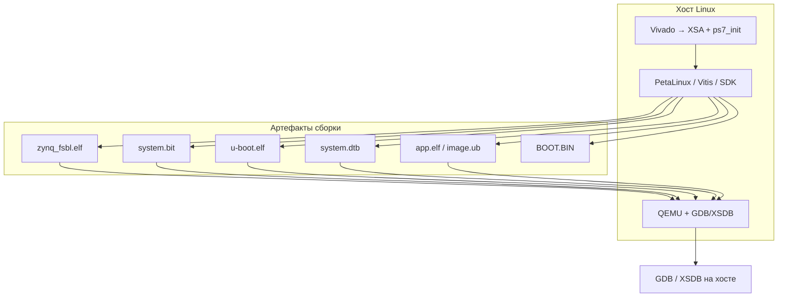

# Чек-лист отладки в QEMU (Antminer S9 / Zynq-7010)

Пошаговый чек-лист для **отладки кода процессора PS** (bare-metal, FSBL, U-Boot, Linux, приложения) на **Antminer S9** через **QEMU**. Плата на **XC7Z010** (Zynq-7010); в QEMU отдельной машины `antminer-s9` **нет** — эмуляция идёт через **прокси Zynq-7000** (`arm-generic-fdt-7series` / `xilinx-zynq-a9`) с **DTB и XSA под S9**.

Связанные документы: [QEMU — ресурсы](../links/QEMU.md) · [BSP — PetaLinux](BSP%20-%20PetaLinux.md) · [чек-лист прошивки](ZYNQ7000%20-%20чек-лист%20прошивки.md) · [Первый запуск S9](Первый%20запуск.md) · [Antminer — ресурсы](../links/Antminer%20-%20ресурсы.md).

Эталон S9 в репозитории: `sample_s9/` (boot log, U-Boot DTS, джамперы, pinout).

---

## Как устроена эмуляция (контекст)

| Что | На реальной S9 | В QEMU |
|-----|----------------|--------|
| **PS** (2× Cortex-A9) | Да | Да — основной объект отладки |
| **PL** (Artix-7) | Ваша логика, EMIO | **Не эмулируется** как на плате; bitstream может грузиться FSBL, но PL-модели нет |
| **NAND 256 MB** | Штатный boot (Bitmain) | Не моделируется 1:1; для QEMU — SD-образ или `-kernel` |
| **microSD** | Своя разработка | Эмулируется как `-drive if=sd` (mainline) или через U-Boot в AMD QEMU |
| **Ethernet RGMII** | `gem0`, PHY @1 | Зависит от DTB; сеть в QEMU опциональна |
| **Boot mode (JP1–JP4)** | NAND / SD / JTAG | **Не нужен** — QEMU всегда «загружает» переданный образ |

**Два семейства QEMU** (не смешивать флаги):

| | **AMD/Xilinx QEMU** | **Mainline QEMU** |
|--|---------------------|-------------------|
| Бинарник | Из PetaLinux/Vitis: `qemu-system-aarch64` | Из дистрибутива: `qemu-system-arm` |
| Машина | `-M arm-generic-fdt-7series` | `-M xilinx-zynq-a9` |
| DTB | `-hw-dtb` / `-dtb` из PetaLinux `images/linux/` | `-dtb` (часто ZC702 или свой) |
| Интеграция | `petalinux-boot --qemu` | Ручная командная строка |
| Отладка PL (co-sim) | Remote-Port + SystemC | Нет |



---

## Общая схема (порядок работ)

1. **Установить** Vivado + PetaLinux (одна версия) → получить **AMD QEMU** из toolchain.
2. **Собрать аппаратуру** в Vivado под S9 → **XSA** + `ps7_init`.
3. **Создать PetaLinux-проект** (с нуля или от EBAZ4205) → **адаптировать DTS под S9**.
4. **Собрать** FSBL, U-Boot, kernel, rootfs, **BOOT.BIN** / `.elf` приложения.
5. **Запустить QEMU** с нужными образами.
6. **Подключить отладчик** (`-gdb tcp::port -S` → GDB или XSDB).

### S9 vs прокси-платформа в QEMU

| Параметр | Antminer S9 (реальность) | Что задать в QEMU / DTS |
|----------|--------------------------|-------------------------|
| Кристалл | XC7Z010 CLG400 | `xc7z010clg400-1` в Vivado |
| DDR | 512 MB типично (до 1 GB на C41 V1.2) | `memory@0 { reg = <0x0 0x20000000>; }` = 512M или `0x40000000` = 1G — см. `sample_s9/boot/uboot_bitmain-antminer-s9.dts` |
| UART консоль | **ttyPS0**, 115200 (`uart1` в polprog DTS) | `console=ttyPS0,115200` в bootargs |
| Ethernet | **RGMII** `phy-mode = "rgmii-id"`, PHY @1 | `&gem0` в `system-user.dtsi` |
| SDIO | `sdhci0` на плате | В DTB для эмуляции SD-диска |
| NAND | Штатный boot | В QEMU не использовать на первом этапе |
| Эталон U-Boot DTS | `sample_s9/boot/uboot_bitmain-antminer-s9.dts` | Перенести в `meta-user/.../system-user.dtsi` |

**Готового PetaLinux BSP для S9 в открытых репо нет** (`polprog/antminer_zynq` — в планах). Практичный путь: **wavelet2/EBAZ4205** или **har-in-air** как шаблон → заменить DTS/BD под S9.

---

## A. Установка окружения на хосте

### A1. ОС и ресурсы

- [ ] **A1.1.** Хост: **Ubuntu 20.04 / 22.04** 64-bit (рекомендуется AMD/Xilinx; WSL2 — с оговорками для PetaLinux)
- [ ] **A1.2.** Диск: **≥ 100 GB** свободно (PetaLinux + Vivado)
- [ ] **A1.3.** RAM: **≥ 16 GB** на хосте
- [ ] **A1.4.** Зафиксировать **одну линейку** инструментов (см. `sample_s9/tools/versions.txt`); Vivado и PetaLinux — **одинаковый релиз** (напр. 2022.2 + 2022.2)

### A2. Vivado / Vitis

- [ ] **A2.1.** Скачать с [xilinx.com/support/download.html](https://www.xilinx.com/support/download.html)
- [ ] **A2.2.** Установить **Vivado** (или Vitis с embedded)
- [ ] **A2.3.** Лицензия WebPACK достаточна для XC7Z010
- [ ] **A2.4.** Проверка: `vivado -version`

### A3. PetaLinux (даёт QEMU + кросс-GDB)

- [ ] **A3.1.** Скачать **PetaLinux** той же версии, что Vivado
- [ ] **A3.2.** Установить зависимости по UG1144 / installer
- [ ] **A3.3.** Каждую сессию: `source /opt/pkg/petalinux/<ver>/settings.sh`
- [ ] **A3.4.** Проверка: `which petalinux-build`, `which qemu-system-aarch64`

Путь к QEMU в toolchain (типично):

```text
<petalinux-install>/components/yocto/buildtools/sysroots/x86_64-petalinux-linux/usr/bin/qemu-system-aarch64
```

Или после `petalinux-build` в проекте — в `build/tmp/sysroots-components/...`.

- [ ] **A3.5.** **Не использовать** `qemu-system-arm` из `apt` для `-hw-dtb` и `petalinux-boot --qemu` — нужен **AMD QEMU**

### A4. Отладчики

- [ ] **A4.1.** **GDB** из toolchain: `aarch32-linux-gnu-gdb` / `arm-none-eabi-gdb` (bare-metal) / `aarch64-linux-gnu-gdb` (Linux guest)
- [ ] **A4.2.** Опционально: **XSDB** из Vitis (`xsdb` / `xsct`)
- [ ] **A4.3.** Опционально: `gdb-multiarch` (`apt install gdb-multiarch`)
- [ ] **A4.4.** Сборка приложений с символами: **`-g -O0`** (или `-Og`)

### A5. Опционально: QEMU из исходников

Только если нужна версия/newer co-sim / module debug:

- [ ] **A5.1.** `git clone https://github.com/Xilinx/qemu.git`
- [ ] **A5.2.** `git checkout tags/xilinx-v<версия_как_petalinux>`
- [ ] **A5.3.** Сборка по [wiki](https://xilinx-wiki.atlassian.net/wiki/spaces/A/pages/822312999/Building+and+Running+QEMU+from+Source+Code)
- [ ] **A5.4.** Добавить `qemu-system-aarch64` в `PATH` **вместо** дистрибутивного

---

## B. Аппаратное описание (Vivado) — вход для всех артефактов

Без согласованного BD/PS7 QEMU-образ «не знает» вашу DDR и периферию.

- [ ] **B1.** Проект Vivado: part **`xc7z010clg400-1`**
- [ ] **B2.** Block Design **PS7**: DDR, **UART1** (консоль S9), **SDIO0**, **GEM0** (RGMII), при необходимости **NFC** (для совместимости с DTS, в QEMU не обязателен)
- [ ] **B3.** MIO по схеме S9: кнопки S1/S2, LED — см. `sample_s9/pinout/`, PDF в `sample_s9/scheme/`
- [ ] **B4.** PL: для чистой отладки PS — **пустой fabric** или минимальный bitstream (EMIO Ethernet, если нужен)
- [ ] **B5.** **Generate Bitstream** → **Export Hardware (Include bitstream)** → `design_wrapper.xsa`
- [ ] **B6.** Сохранить **`ps7_init.c` / `ps7_init_gpl.c`** — они попадут в FSBL; несовпадение с QEMU → **зависание FSBL**

| Артефакт | Где после Vivado |
|----------|------------------|
| `*.xsa` | `vivado/<proj>/export/` |
| `*.bit` / `system.bit` | synthesis run |
| `ps7_init*.c/h` | в XSA и при импорте в PetaLinux |

---

## C. PetaLinux-проект под S9 (источник артефактов для QEMU)

### C1. Создание проекта

**Вариант A — новый проект:**

```bash
source <petalinux>/settings.sh
petalinux-create -t project -n s9-plnx --enable-binary-components
cd s9-plnx
petalinux-config --get-hw-description=/path/to/design_wrapper.xsa
```

**Вариант B — от шаблона EBAZ4205** (быстрее первый QEMU):

```bash
git clone https://github.com/wavelet2/EBAZ4205.git
cd EBAZ4205/linux/ebaz4205
petalinux-config --get-hw-description=../../vivado/ebaz4205   # или свой XSA S9
```

- [ ] **C1.1.** `petalinux-config` без ошибок импорта XSA
- [ ] **C1.2.** **Image Packaging**: rootfs **ext4** (для Linux в QEMU), не initrd-only
- [ ] **C1.3.** **DTG bootargs**: `console=ttyPS0,115200 root=/dev/mmcblk0p2 rw rootwait` (подправить под эмуляцию SD при необходимости)

### C2. Адаптация Device Tree под S9

Файл: `project-spec/meta-user/recipes-bsp/device-tree/files/system-user.dtsi`

Ориентир — `sample_s9/boot/uboot_bitmain-antminer-s9.dts` и [U-Boot DTS upstream](https://github.com/Xilinx/u-boot-xlnx/blob/master/arch/arm/dts/bitmain-antminer-s9.dts).

- [ ] **C2.1.** `memory@0`: **512 MB** `reg = <0x0 0x20000000>` или **1 GB** `0x40000000` — сверить с ревизией платы
- [ ] **C2.2.** `&uart1 { status = "okay"; }` — консоль S9
- [ ] **C2.3.** `&gem0 { phy-mode = "rgmii-id"; ... }` — **не** `mii` как на EBAZ
- [ ] **C2.4.** `&sdhci0 { status = "okay"; }`
- [ ] **C2.5.** `chosen { bootargs = "earlycon console=ttyPS0,115200 ..."; }`
- [ ] **C2.6.** После правок: `petalinux-build -c device-tree -x cleansstate && petalinux-build -c device-tree`

### C3. U-Boot и ядро (для Linux-трека)

- [ ] **C3.1.** `petalinux-config -c u-boot` — boot media **SD** (для паритета с SD на плате)
- [ ] **C3.2.** При необходимости: `recipes-bsp/u-boot/files/` — `platform-top.h`, DTS-патчи
- [ ] **C3.3.** `petalinux-config -c kernel` / `rootfs` — нужные пакеты (openssh, gdb на target — для non-intrusive debug)

### C4. Сборка

```bash
petalinux-build
```

- [ ] **C4.1.** Сборка завершилась без ошибок (первая — несколько часов)
- [ ] **C4.2.** Проверить наличие файлов в **`images/linux/`** (см. таблицу ниже)

### C5. Упаковка BOOT.BIN

```bash
cd images/linux
petalinux-package --boot \
  --fsbl zynq_fsbl.elf \
  --fpga system.bit \
  --u-boot u-boot.elf \
  -o BOOT.BIN --force
```

PS-only без PL в образе:

```bash
petalinux-package --boot --fsbl zynq_fsbl.elf --u-boot u-boot.elf -o BOOT.BIN --force
```

- [ ] **C5.1.** `bootgen -arch zynq -read BOOT.BIN` — партиции FSBL / bit / U-Boot на месте

---

## D. Карта артефактов: где собираются и что отдаётся в QEMU

| Артефакт | Где собирается | Путь после `petalinux-build` | Роль в QEMU |
|----------|----------------|------------------------------|-------------|
| **FSBL** | PetaLinux (из XSA + `ps7_init`) | `images/linux/zynq_fsbl.elf` | Первая стадия; в составе `-kernel` / цепочки загрузки |
| **Bitstream** | Vivado → PetaLinux | `images/linux/system.bit` | Опционально в BOOT.BIN; PL в QEMU не работает |
| **U-Boot** | PetaLinux | `images/linux/u-boot.elf`, `u-boot.bin` | **`-kernel u-boot.elf`** (AMD шаблон Zynq-7000) |
| **Kernel DTB** | PetaLinux device-tree | `images/linux/system.dtb` | **`-dtb`** / **`-hw-dtb`** — модель машины для AMD QEMU |
| **image.ub** | PetaLinux FIT | `images/linux/image.ub` | Kernel+dtb для U-Boot на реальной SD; в QEMU — через U-Boot или отдельно |
| **boot.scr** | PetaLinux | `images/linux/boot.scr` | Для SD на плате; в QEMU часто не нужен |
| **rootfs.ext4** | PetaLinux | `images/linux/rootfs.ext4` | Корневая ФС: `-drive` / initrd / смонтированный образ |
| **BOOT.BIN** | `petalinux-package --boot` | `images/linux/BOOT.BIN` | Для **платы** (SD); в QEMU AMD часто грузят **u-boot.elf** напрямую |
| **Приложение .elf** | Vitis/SDK / `petalinux-build -c <app>` | `build/tmp/...` или `images/linux/` | Bare-metal: **`-kernel app.elf`** или `-device loader,file=...` |
| **vmlinux** | Сборка ядра с debug | `build/tmp/work-shared/.../vmlinux` | Символы для отладки **ядра** в GDB |
| **qemu_args.txt** | Vitis / ручной | в platform project | Параметры PS для QEMU (UG1702) |

### Bare-metal (KarolNi / SDK) — отдельный трек

| Артефакт | Где собирается | Примечание |
|----------|----------------|------------|
| `helloworld.elf` / `app.elf` | Vitis standalone на `ps7_cortexa9_0` | `-g`, linker script из BSP |
| `fsbl.elf` | Vitis FSBL project или PetaLinux | Тот же `ps7_init`, что в XSA |
| `BOOT.BIN` | `bootgen` + `.bif` | Для платы; в QEMU — часто только `.elf` |

Референс: [KarolNi/S9miner_sample](https://github.com/KarolNi/S9miner_sample) P04_SD_BOOT (на плату; для QEMU — те же `.elf`, другой способ загрузки).

---

## E. Развёртывание образов в QEMU (не SD-карта)

На **реальной S9** образы пишутся на **microSD** (FAT + ext4) или **NAND**. В **QEMU** файлы передаются **аргументами командной строки** или через **`petalinux-boot --qemu`**.

### E1. PetaLinux — самый простой старт (Linux)

Из каталога PetaLinux-проекта:

```bash
# Полная цепочка до Linux (образы из images/linux/)
petalinux-boot --qemu --kernel

# Prebuilt demo (проверка toolchain; машина ZC702, не S9)
petalinux-boot --qemu --prebuilt 3

# Доп. аргументы QEMU (GDB, память, диск)
petalinux-boot --qemu --kernel \
  --qemu-args "-gdb tcp::9000 -S"
```

- [ ] **E1.1.** В логе видны строки **FSBL** → **U-Boot** → **Linux**
- [ ] **E1.2.** Консоль на **stdio** (в терминале, где запущен QEMU)
- [ ] **E1.3.** Выход из QEMU: **Ctrl+A**, затем **X** (см. UG1169)

Перед первым S9-специфичным запуском имеет смысл **E1 с prebuilt** — убедиться, что QEMU из PetaLinux работает.

### E2. AMD QEMU — ручная команда (Zynq-7000 template)

Шаблон из [Running Bare Metal / Zynq7000](https://xilinx-wiki.atlassian.net/wiki/spaces/A/pages/821854273/Running+Bare+Metal+Applications+on+QEMU) и UG1169:

```bash
cd <s9-plnx>/images/linux

qemu-system-aarch64 \
  -M arm-generic-fdt-7series \
  -machine linux=on \
  -serial /dev/null -serial mon:stdio \
  -display none \
  -kernel u-boot.elf \
  -dtb system.dtb \
  -m 512M \
  -device loader,addr=0xf8000008,data=0xDF0D,data-len=4 \
  -device loader,addr=0xf8000140,data=0x00500801,data-len=4 \
  -device loader,addr=0xf800012c,data=0x1ed044d,data-len=4 \
  -device loader,addr=0xf8000108,data=0x0001e008,data-len=4 \
  -device loader,addr=0xf8000910,data=0x0000000F,data-len=4
```

- [ ] **E2.1.** `-m 512M` или `1024M` — согласовать с DTS
- [ ] **E2.2.** `loader,addr=0xf800...` — **обязательны** для Linux на Zynq-7000 (инициализация SLCR)
- [ ] **E2.3.** Для **bare-metal .elf** вместо `-kernel u-boot.elf`:

```bash
  -kernel /path/to/app.elf
  # или
  -device loader,file=/path/to/app.elf,cpu-num=0
```

### E3. Mainline QEMU (`xilinx-zynq-a9`)

Для быстрых экспериментов без PetaLinux (ZC702 DTB или свой):

```bash
qemu-system-arm \
  -M xilinx-zynq-a9 \
  -m 512M \
  -nographic \
  -kernel app.elf \
  -serial mon:stdio \
  -gdb tcp::1234 -S
```

- [ ] **E3.1.** UART может молчать без правильного BSP/semihosting — см. [qemu-discuss](https://lists.nongnu.org/archive/html/qemu-discuss/2020-02/msg00027.html)
- [ ] **E3.2.** Для Linux: `-kernel uImage -dtb zynq-zc702.dtb -append "console=ttyPS0,115200 ..."`

### E4. Эмуляция SD-карты (rootfs как на плате)

Собрать образ диска с разделами FAT + ext4 (как в [BSP — PetaLinux](BSP%20-%20PetaLinux.md)), затем:

```bash
-drive file=sdcard.img,if=sd,format=raw
```

- [ ] **E4.1.** На FAT: `BOOT.BIN`, `boot.scr`, `image.ub` (как для реальной SD)
- [ ] **E4.2.** Второй раздел ext4: `rootfs.ext4` или смонтированный образ

### E5. Что **не** нужно разворачивать в QEMU

| На плате S9 | В QEMU на первом этапе |
|-------------|------------------------|
| Джамперы JP1–JP4 | Не нужны |
| Прошивка NAND | Не использовать |
| Штатный образ Bitmain | Не совместим напрямую |
| JTAG-кабель | Заменён GDB stub QEMU |

---

## F. Подключение отладчика

### F1. Запуск QEMU с GDB-сервером

Добавить к команде QEMU:

```text
-gdb tcp::9000 -S
```

`-S` — пауза до подключения отладчика (удобно для FSBL / `_start`).

Через PetaLinux:

```bash
petalinux-boot --qemu --kernel --qemu-args "-gdb tcp::9000 -S"
```

- [ ] **F1.1.** Порт **9000** — типичный для PetaLinux; можно другой свободный порт
- [ ] **F1.2.** QEMU «висит» до `continue` в GDB — это нормально

### F2. GDB — bare-metal / FSBL / U-Boot (kernel-intrusive)

Терминал 2:

```bash
# Из toolchain PetaLinux / Vitis
arm-none-eabi-gdb images/linux/zynq_fsbl.elf
# или app.elf, u-boot.elf

(gdb) target remote localhost:9000
(gdb) b main          # или Reset_Handler, FsblHandoff, _start
(gdb) continue
(gdb) step / next / info registers
```

- [ ] **F2.1.** GDB **той же** линейки, что собирал ELF (arm-none-eabi vs aarch32-linux-gnu)
- [ ] **F2.2.** `file app.elf` до `target remote`, если символы не подхватились
- [ ] **F2.3.** Для **раннего boot**: breakpoint на `0x0` / `_vector_table` / entry FSBL

### F3. GDB — отладка ядра Linux

```bash
aarch64-linux-gnu-gdb vmlinux
(gdb) target remote localhost:9000
(gdb) b start_kernel
(gdb) continue
```

- [ ] **F3.1.** Ядро собрано с `CONFIG_DEBUG_INFO=y`
- [ ] **F3.2.** `vmlinux` из `build/tmp/work-shared/<machine>/kernel-build-artifacts/`

### F4. GDB — приложение на уже загруженном Linux (non-intrusive)

На guest (если есть gdbserver в rootfs):

```bash
gdbserver :5678 ./my_app
```

На хосте:

```bash
aarch32-linux-gnu-gdb my_app
(gdb) target remote localhost:5678
```

- [ ] **F4.1.** Добавить `gdbserver` в rootfs через `petalinux-config -c rootfs`

### F5. XSDB / Vitis

```tcl
xsdb
gdbremote connect localhost:9000
memmap -file /path/to/app.elf
# ta 1  — target A9 core 0
# bpadd -addr ...
# c
```

См. [Debugging with XSDB](https://xilinx-wiki.atlassian.net/wiki/spaces/A/pages/821985347/Debugging%20Guest%20Applications%20with%20QEMU).

- [ ] **F5.1.** Символы загружены через `memmap -file`

### F6. Ограничения GDB в QEMU

| Ситуация | Поведение |
|----------|-----------|
| **SIGSEGV** в guest | QEMU GDB server **не ловит** — процесс завершается |
| **SIGINT / SIGTRAP** | Ловятся — breakpoints, single-step |
| Watchpoints | Ограниченная поддержка; в XSDB бывают рассинхроны |

---

## G. Сценарии отладки (что выбрать)

| Цель | Стек | Загрузка в QEMU | Отладчик |
|------|------|-----------------|----------|
| **Hello World bare-metal** | Vitis standalone | `-kernel app.elf` + S9 DTB | `arm-none-eabi-gdb` |
| **FSBL / ранний boot** | PetaLinux FSBL | `-kernel zynq_fsbl.elf` или цепочка с `-S` | GDB, breakpoint до DDR init |
| **U-Boot** | PetaLinux | `-kernel u-boot.elf` | GDB на `board_init_f` |
| **Драйвер / app в Linux** | PetaLinux rootfs | `petalinux-boot --qemu --kernel` | gdbserver на guest или intrusive на ядро |
| **Сравнение с штатным S9** | Эталон log | QEMU **не заменяет** NAND boot | Сверять UART-текст с `sample_s9/boot/bootlog_stock_nand.log` |
| **Логика в PL** | Vivado RTL | Co-simulation | [Co-simulation](../links/QEMU.md) + `libsystemctlm-soc` — отдельный трек |

### Минимальный путь «первый debug за день»

1. Установить PetaLinux + проверить `petalinux-boot --qemu --prebuilt 3`
2. Клонировать wavelet2 EBAZ4205 → `petalinux-build`
3. Подменить `system-user.dtsi` на параметры S9 (память, gem0 RGMII, uart1)
4. `petalinux-boot --qemu --kernel --qemu-args "-gdb tcp::9000 -S"`
5. `aarch32-linux-gnu-gdb` → `target remote :9000` → `c`

---

## H. Верификация и эталоны

- [ ] **H1.** Сохранить **полный лог консоли** QEMU (FSBL → U-Boot → Linux) в файл
- [ ] **H2.** Сравнить с `sample_s9/boot/bootlog_stock_nand.log` — **размер DDR**, `ttyPS0`, наличие `gem0` (на штатной: `Gem.e000b000`)
- [ ] **H3.** Проверить `Machine model:` в логе ядра — после адаптации DTS должно отражать вашу плату, не «голый» ZC702
- [ ] **H4.** Зафиксировать версии в `sample_s9/tools/versions.txt` или своём README проекта
- [ ] **H5.** После отладки в QEMU — **повторить на реальной S9** (JP1–JP4 = SD `0101`, образ на microSD) — см. [Первый запуск](Первый%20запуск.md)

---

## I. Типичные проблемы

| Симптом | Вероятная причина | Действие |
|---------|-------------------|----------|
| FSBL **зависает**, нет UART | `ps7_init` / DDR не совпадает с QEMU | Упростить BD; сверить с [Known Issues FSBL](https://xilinx-wiki.atlassian.net/wiki/spaces/A/pages/862421130/Known+Issues); временно PS-only |
| `-hw-dtb: invalid option` | Запущен **mainline** QEMU | Использовать бинарник из PetaLinux |
| GDB не коннектится | Неверный порт / firewall | `ss -tlnp \| grep 9000`; тот же `localhost` |
| **Тишина на UART** в bare-metal | Неверный UART в BSP / нет `serial mon:stdio` | Проверить `aliases serial0 = &uart1`; флаги `-serial` |
| Linux panic `Unable to mount root` | Нет rootfs / неверный `root=` | Подключить `-drive` с ext4 или initrd |
| Ethernet не работает | RGMII / PHY не эмулируется полностью | Для отладки PS не критично; проверять на плате |
| Отладка PL | PL нет в QEMU | Co-simulation или только JTAG на железе |
| 512 vs 1024 MB | Неверный `memory@0` | Kangyuzhe666: ревизия C41; замерить на плате |

---

## J. Чек-лист «готов к отладке S9 в QEMU»

Сводный финальный проход:

- [ ] Vivado + PetaLinux одной версии, **AMD QEMU** в PATH
- [ ] XSA для **xc7z010clg400-1** с UART1, GEM0, SDIO
- [ ] PetaLinux-проект собран, **`images/linux/system.dtb`** отражает S9 (память, RGMII, uart1)
- [ ] Есть **`u-boot.elf`** и/или **`app.elf`** с **`-g`**
- [ ] QEMU стартует (`petalinux-boot --qemu --kernel` или ручная команда E2)
- [ ] В консоли виден вывод FSBL/U-Boot/приложения
- [ ] **`-gdb tcp::9000 -S`** + GDB/XSDB подключается и доходит до `main` / `start_kernel`
- [ ] План переноса на **реальную S9** (SD-образ, джамперы) записан

---

## K. Ссылки и репозитории

| Ресурс | Назначение |
|--------|------------|
| [QEMU — ресурсы](../links/QEMU.md) | Полный каталог UG/wiki |
| [UG1169](https://docs.amd.com/v/u/en-US/ug1169-xilinx-qemu) | Официальный гайд QEMU |
| [UG1702 — Zynq 7000 PS Arguments](https://docs.amd.com/r/en-US/ug1702-vitis-accelerated-reference/Zynq-7000-PS-Arguments-for-QEMU) | `qemu_args.txt` |
| [wavelet2/EBAZ4205](https://github.com/wavelet2/EBAZ4205) | Шаблон PetaLinux BSP |
| [polprog/antminer_zynq](https://github.com/polprog/antminer_zynq) | S9 boot log, U-Boot DTS |
| [KarolNi/S9miner_sample](https://github.com/KarolNi/S9miner_sample) | Bare-metal примеры |
| [iliasam/OpenZynqSDR_HW](https://github.com/iliasam/OpenZynqSDR_HW) | PetaLinux на S9 (Habr) |
| [trebisky Antminer](http://cholla.mmto.org/zynq/antminer/) | Boot chain на реальном железе |

---

## Минимум vs полный цикл

| Цель | Минимум | Полный цикл |
|------|---------|-------------|
| Проверить toolchain QEMU | `petalinux-boot --qemu --prebuilt 3` | + свой PetaLinux проект |
| Отладить **bare-metal** | Vitis `.elf` + mainline `xilinx-zynq-a9` + GDB | PetaLinux DTB S9 + AMD QEMU |
| Отладить **Linux app** | prebuilt + gdbserver в rootfs | Свой rootfs + `petalinux-boot --qemu --kernel` |
| Отладить **FSBL** | `zynq_fsbl.elf` + `-S` + GDB | Свой XSA + правки `ps7_init` под QEMU hangs |
| Перенос на **плату S9** | BOOT.BIN + SD + JP `0101` | См. [чек-лист прошивки](ZYNQ7000%20-%20чек-лист%20прошивки.md) |
